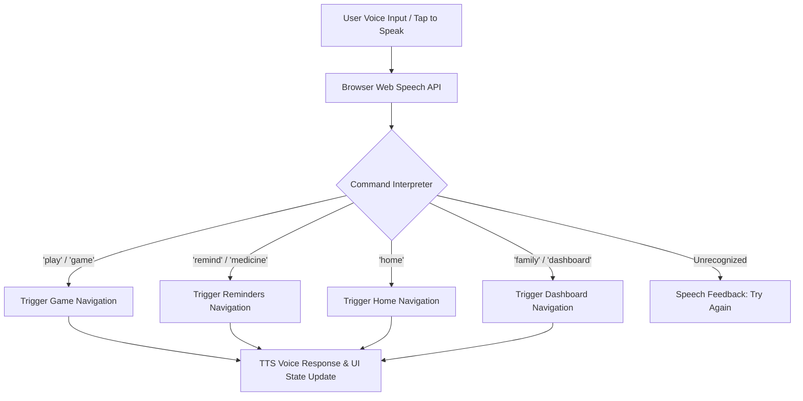

# NeuroNortheast - SIH Prototype

**Problem Statement:** AI-Based Cognitive Gaming and Memory Assistance Platform for Elderly Dementia Patients in North Eastern Region (NER).

This prototype is a React + Vite web application built specifically with dementia accessibility in mind. It features "Zero Learning Curve" UX, localized North Eastern Region (NER) elements, a persistent voice assistant, cognitive gaming, and an offline-first architecture.

## Agent Workflows

### 1. Voice Assistant Agent Workflow

### 2. ADK Agent Development Workflow
| Phase | Name | Description & Actions |
|-------|------|-----------------------|
| **Phase 0** | **Understand** | Define agent core purpose, safety guardrails, tools, and deployment target in `.agents-cli-spec.md`. |
| **Phase 1** | **Study Reference Samples** | Review reference samples (`adk-samples`) for architectural design patterns. |
| **Phase 2** | **Scaffold** | Initialize project structure with `agents-cli scaffold create` or enhance existing code via `agents-cli scaffold enhance`. |
| **Phase 3** | **Build & Implement** | Implement core logic, tools, callbacks, and state. Test locally with `agents-cli run` or `agents-cli playground`. |
| **Phase 3.5** | **Provision Datastore** | (RAG Projects) Provision vector/search datastore and run data ingestion with `agents-cli infra datastore`. |
| **Phase 4** | **Evaluate** | Systematic validation using eval datasets and LLM-as-judge scoring via `agents-cli eval`. |
| **Phase 5** | **Deploy** | Target Cloud Run, Agent Runtime, or GKE using `agents-cli deploy`. |
| **Phase 6** | **Publish** | Register deployed agent with Gemini Enterprise using `agents-cli publish gemini-enterprise`. |
| **Phase 7** | **Observe** | Telemetry exports, trace logging (Cloud Trace), and BigQuery Agent Analytics setup. |

## Architecture Notes
- **Offline-First Design:** For the hackathon MVP, state is managed locally via React Context and `localStorage`. In a real-world scenario, this will map to SQLite/Room for local device storage, syncing to Firebase/Supabase only when an internet connection is available (crucial for remote NER areas).
- **Voice AI:** Currently utilizes the native browser `Web Speech API` (SpeechRecognition and SpeechSynthesis) for free, on-device NLP. Post-hackathon, this module is structured to be easily swapped with the **Govt of India Bhashini API** for robust Assamese/Bodo/Manipuri translation and voice processing.

## Setup & Run Locally
1. `npm install`
2. `npm run dev`

## Deployment (Vercel / Netlify)
1. Push this repository to GitHub.
2. Import the project in Vercel or Netlify.
3. Build command: `npm run build`
4. Output directory: `dist`

